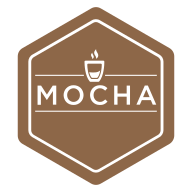

<p align="center">
  
</p>

<p align="center">☕️ Classic, reliable, trusted test framework for Node.js and Bun ☕️</p>

<div align="center">

<a href="https://www.npmjs.com/package/mocha"></a> <!-- x-release-please-version -->
<a href="https://github.com/mochajs/mocha"></a>
[](https://github.com/mochajs/mocha/actions/workflows/mocha.yml)
<a href="https://codecov.io/gh/mochajs/mocha"></a>

</div>

<div align="center">

<a href="https://discord.gg/KeDn2uXhER"></a>
<a href="https://github.com/mochajs/mocha#sponsors"></a>
<a href="https://github.com/mochajs/mocha#backers"></a>
[](https://github.com/collective-funds/guidelines)

</div>

## mocha-bun (Bun fork)

This is `mocha-bun`. It is a fork of `mocha@12.0.0-rc.6`. It adds support for Bun 1.4 and later. It does not support the browser.

- **Engines:** Use `node >=22.12.0` or `bun >=1.4.0`.
- **Bin:** The fork provides `mocha` and `mocha-bun`. `mocha` uses `node`. `mocha-bun` uses `bun`. You do not need to edit `node_modules/.bin`. Use `bunx mocha-bun` or `bun ./bin/mocha-bun.js` for Bun. Use `npx mocha` or `node ./bin/mocha.js` for Node.
- **Parallel:** For Bun, the fork uses `BunForkPool`. For Node, it uses `Piscina`. `BunForkPool` uses `fork` and a queue. `Piscina` uses threads. The test shows `bun --parallel` at 69 ms and `node --parallel` at 78 ms.
- **Glob:** The fork uses `node:fs.globSync`. It replaces `glob` in `lookup-files.js` and `watch-run.cjs`. It uses `minimatch.braceExpand` for brace patterns.
- **ESM:** The CLI layer uses ESM. The files are `options.js`, `collect-files.js`, and `node-flags.js`. The fork uses `errors.cjs` shims to avoid `require(esm)` errors on Bun.
- **Globals:** The fork uses `globalThis` with a fallback to `global`. The files are `runner`, `runnable`, `reporters`, and `mocha.cjs`.

Install (private fork):
```bash
bun install mocha-bun   # or from this repo: bun install
bun ./bin/mocha-bun.js --no-config test/smoke/smoke.spec.cjs
bun ./bin/mocha-bun.js --no-config --parallel test/**/*.spec.cjs
```
Test matrix: `npm run test-bun` (smoke+unit+integration on Bun), `npm run test-node` (Node), `npm run test-bun:parallel-smoke`.

## Links

- **[Documentation](https://mochajs.org)**
- **[Release Notes / History / Changes](https://github.com/mochajs/mocha/blob/main/CHANGELOG.md)**
- [Code of Conduct](https://github.com/mochajs/mocha/blob/main/.github/CODE_OF_CONDUCT.md)
- [Contributing](https://github.com/mochajs/mocha/blob/main/.github/CONTRIBUTING.md)
- [Development](https://github.com/mochajs/mocha/blob/main/.github/DEVELOPMENT.md)
- [Discord](https://discord.gg/KeDn2uXhER) (ask questions here!)
- [Issue Tracker](https://github.com/mochajs/mocha/issues)

## Backers

[Become a backer](https://opencollective.com/mochajs) and show your support to our open source project on [our site](https://mochajs.org/#backers).

<a href="https://opencollective.com/mochajs"></a>

## Sponsors

Does your company use Mocha? Ask your manager or marketing team if your company would be interested in supporting our project.
Support will allow the maintainers to dedicate more time for maintenance and new features for everyone.
Also, your company's logo will show [on GitHub](https://github.com/mochajs/mocha#readme) and on [our site](https://mochajs.org#sponsors) - who doesn't want a little extra exposure?
[Here's the info](https://opencollective.com/mochajs).

[](https://opencollective.com/mochajs/tiers/sponsors/0/website)
[](https://opencollective.com/mochajs/tiers/sponsors/1/website)
[](https://opencollective.com/mochajs/tiers/sponsors/2/website)
[](https://opencollective.com/mochajs/tiers/sponsors/3/website)

## Development

You might want to know that:

- Mocha is one of the _most-depended-upon_ modules on npm (source: [libraries.io](https://libraries.io/search?order=desc&platforms=NPM&sort=dependents_count)), and
- Mocha is an _independent_ open-source project, maintained exclusively by volunteers.

You might want to help:

- New to contributing to Mocha? Check out this list of [good first issues](https://github.com/mochajs/mocha/issues?q=is%3Aopen+is%3Aissue+label%3A%22good+first+issue%22)
- Mocha could use a hand with [these issues](https://github.com/mochajs/mocha/issues?q=is%3Aopen+is%3Aissue+label%3A%22status%3A+accepting+prs%22)
- The [maintainer's handbook](https://github.com/mochajs/mocha/blob/main/MAINTAINERS.md) explains how things get done

Finally, come [chat with the maintainers on Discord](https://discord.gg/KeDn2uXhER) if you want to help with:

- Triaging issues, answering questions
- Review, merging, and closing pull requests
- Other project-maintenance-y things

## License

Copyright 2011-2024 OpenJS Foundation and contributors. Licensed [MIT](https://github.com/mochajs/mocha/blob/main/LICENSE).
